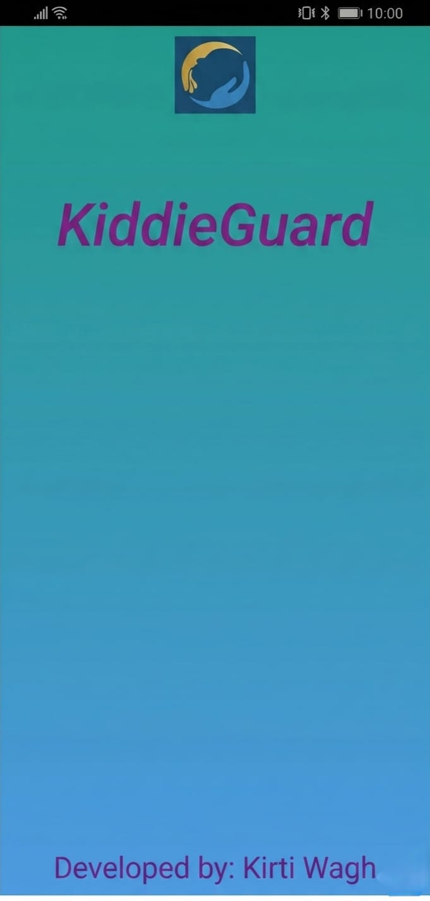
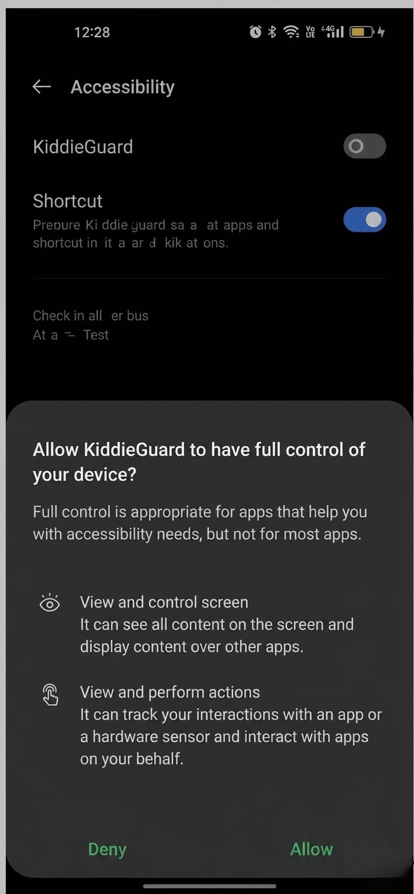
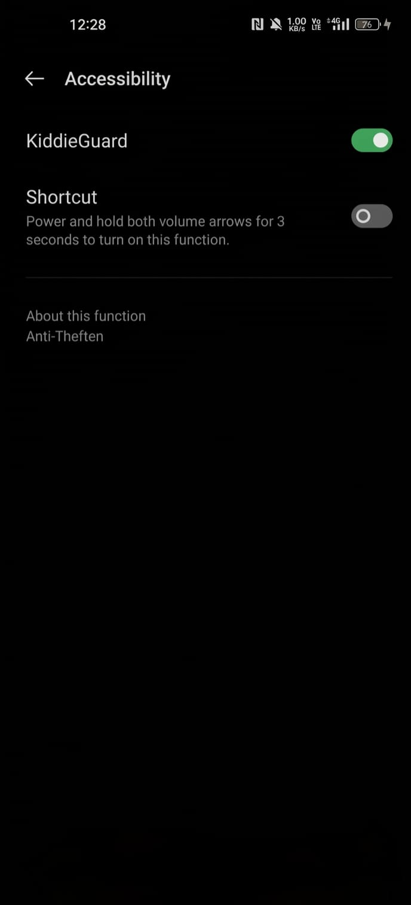
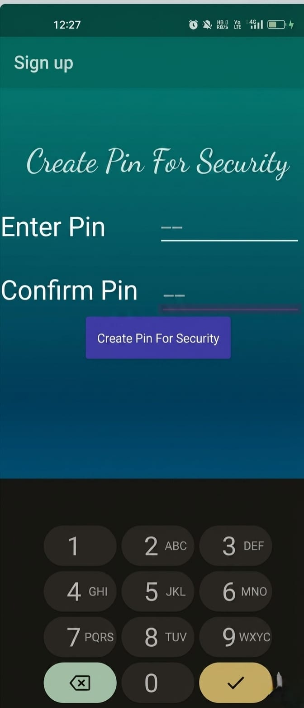
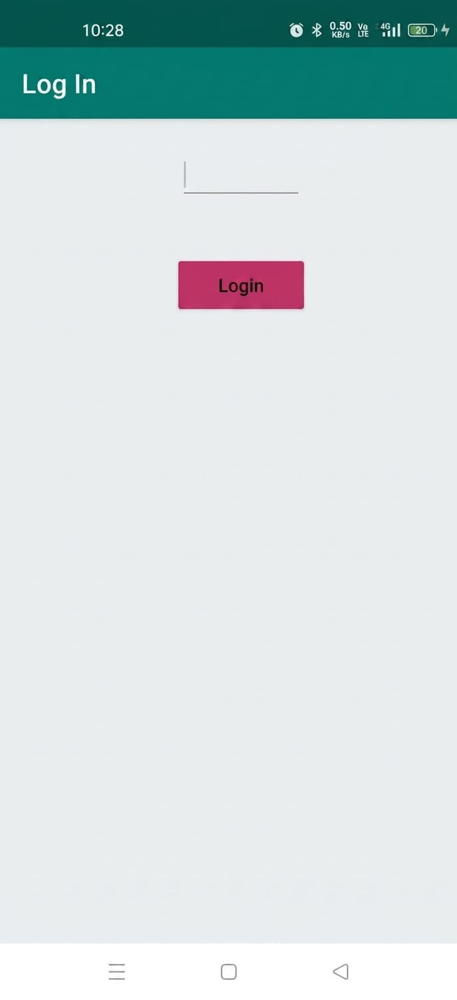
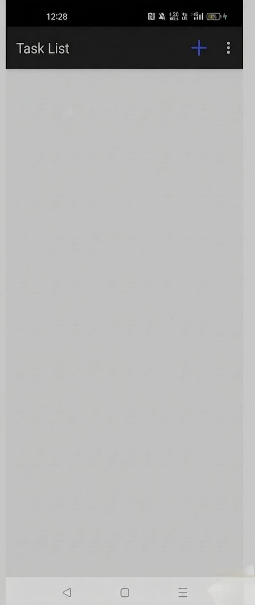
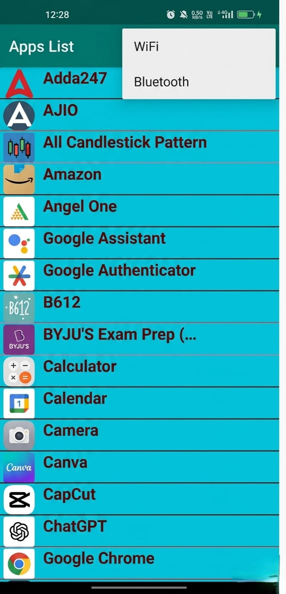
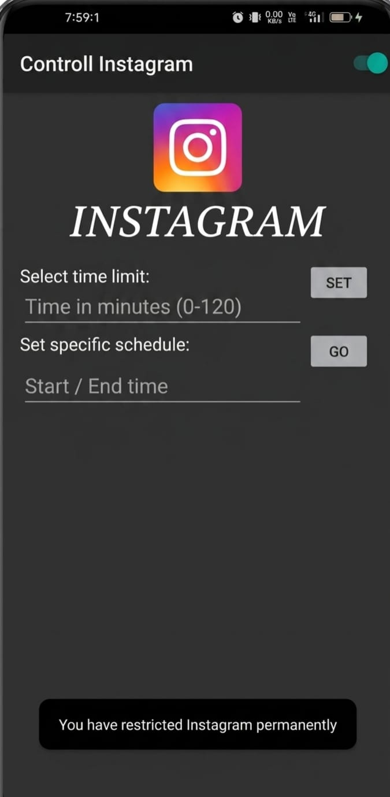
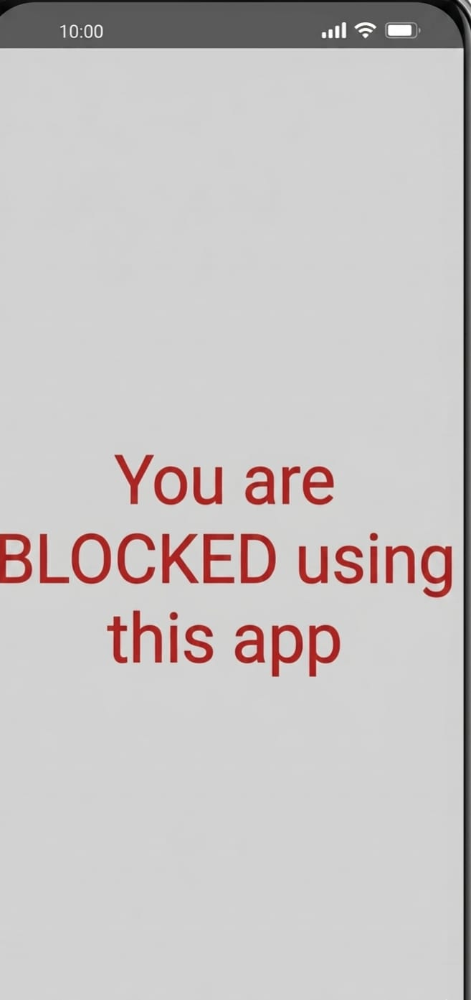
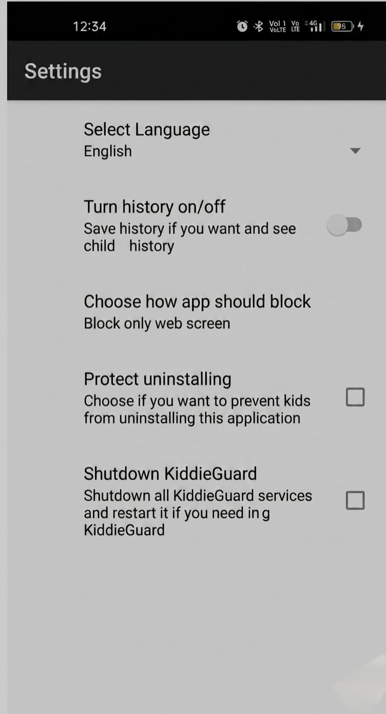

#  Parental Control App (Prototype)

##  Overview

The Parental Control App is an Android-based application designed to help parents monitor and manage their children's smartphone usage. This prototype focuses on key features that promote digital safety and responsible usage.

---

##  Features

*  Screen time monitoring (UI representation)
*  App blocking interface
*  Usage tracking dashboard
*  Location tracking (conceptual UI)
*  Secure login interface

---

##  Tech Stack

* Java
* XML
* Android Studio

---

##  Screenshots

---

##  Purpose

This project was developed as part of academic learning to understand Android app design, UI development, and user-centric application flow.

---

##  Future Improvements

* Real-time monitoring using Firebase
* Push notifications for alerts
* Advanced parental controls

